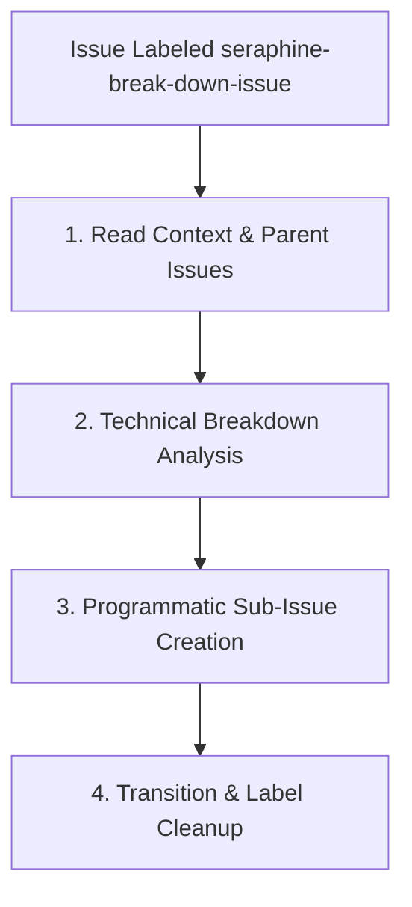

# 🛠️ The `seraphine-break-down-issue` Label Workflow

When a sub-issue is labeled with `seraphine-break-down-issue` (typically the `[Breakdown]` sub-issue), the AI assistant (**Seraphine**) is triggered to break the technical implementation plan down into highly granular, junior-engineer-friendly component issues.

## 🔄 Workflow Lifecycle

---

## 📋 Phase Guidelines

### 1. Read Context & Parent Issues
The agent must read the description/body of the current breakdown issue and extract the referenced implementation plan issue number (e.g., `#123` or direct link) to fetch the approved technical implementation plan and preceding discussions. This ensures the full historical context is captured before breaking down tasks.

### 2. Technical Breakdown Analysis
Seraphine analyzes the technical implementation plan proposed in the current issue to isolate discrete work items.
* **Granularity Goal:** Design tasks that are easily reviewable and can be completed in a single code change.
* **Component Boundaries:** Each sub-issue must target a single, isolated slice of the technology stack. For example:
  - Just the backend Protocol Buffer definition and `pstore` serialization layer.
  - Just the Go gRPC service handler or sync loop logic.
  - Just a specific frontend React component, route, or styling layout.
* **Self-Contained Verification:** Each component must be capable of being coded and tested in isolation (e.g., has its own unit tests, mock data, or visual validation).
* **Dependency Identification:** Explicitly identify dependencies between component tasks. If task X is dependent on task Y being completed first, this sequence must be highlighted.

### 3. Programmatic Sub-Issue Creation
For each identified component, Seraphine programmatically files a new **native GitHub sub-issue** under the current `[Breakdown]` issue.
* **Sub-Issue Title:** Must use the format `[Sub-Issue] <Action>` (e.g., `[Sub-Issue] Implement pstore serialization for note status`).
* **Sub-Issue Body:** Sub-issues should stand alone and do not need to include the parent implementation plan. **Explicitly state issue dependencies in the description: if sub-issue X is dependent on sub-issue Y, this relationship must be clearly documented. They must use native GitHub sub-issues to define the parent relationship to the `[Breakdown]` issue.**
* **Sub-Issue Label:** Must be marked with the `seraphine-ready-to-implement` label.
* **Assignee:** Must be assigned to `brotherlogic-automation`.

### 4. Transition & Label Cleanup
Once all component sub-issues are successfully filed:
* **Remove the Label:** Remove the `seraphine-break-down-issue` label from the current `[Breakdown]` issue.
* **Keep Issue Open:** Do **not** close the `[Breakdown]` issue. Keep it open to serve as the overarching coordination point for the child tasks.
