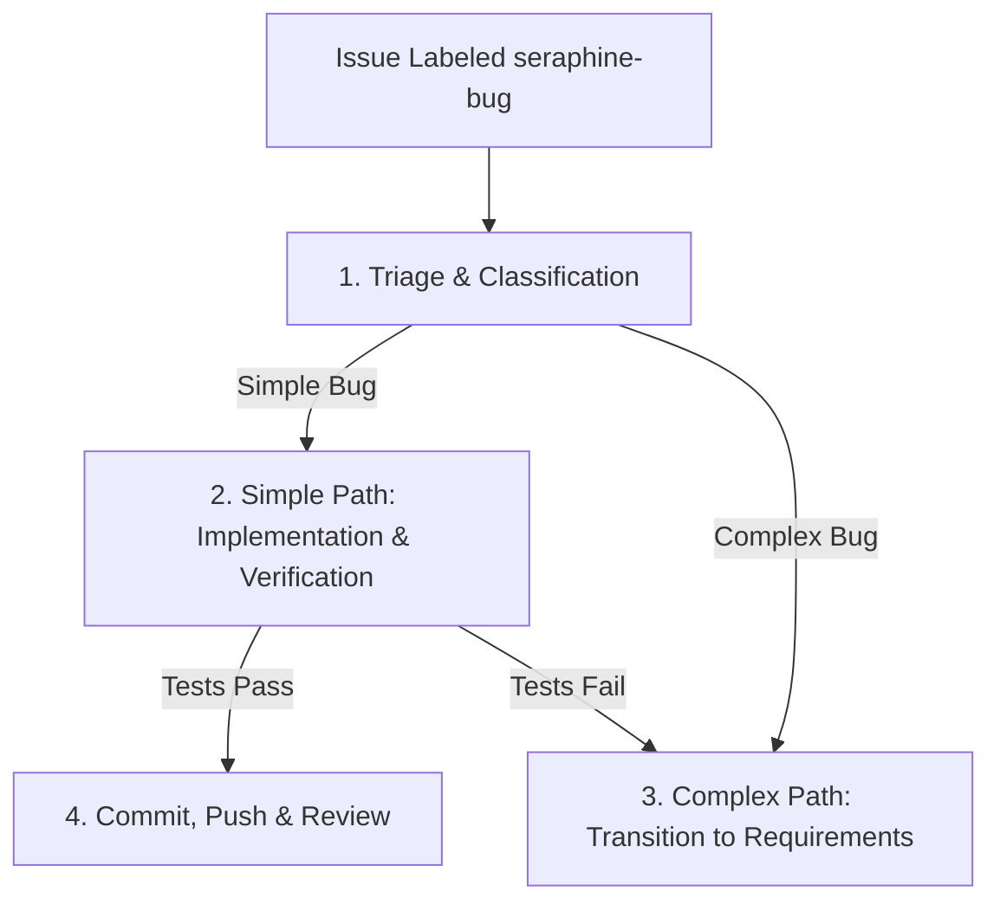

# 🐛 The `seraphine-bug` Label Workflow

When a GitHub issue is labeled with `seraphine-bug`, the AI assistant (**Seraphine**) is triggered to triage and resolve the bug using a structured and disciplined process.

## 🔄 Workflow Lifecycle

---

## 📋 Phase Guidelines

### 1. Triage & Classification
Before writing any code, the agent must evaluate the complexity of the reported bug.
* **Triage Rules:**
  - **Simple Bug:** The bug description is clear and localized, and the solution is unambiguous and does not require complex design decisions or external input.
  - **Complex Bug:** The bug is ambiguous, requires architectural decisions, affects multiple subsystems, or needs clarification from the user/maintainer.
* **Fallback Rule:** If the agent cannot confidently classify the bug as simple, it must default to the **Complex Bug** path.

### 2. Simple Path: Implementation & Verification
If the bug is classified as simple, the agent implements the fix immediately.
* **Triage to Fix:**
  - Write or modify unit tests to reproduce the issue (TDD style).
  - Implement the fix to make the tests pass cleanly.
* **Verification:** Run all tests (e.g., `go test -v ./...`) to verify that the fix is correct and introduces no regressions.
* **Failed Verification:** If the fix fails verification or tests do not pass, the agent must revert any changes and transition immediately to the **Complex Path**.

### 3. Complex Path: Transition to Requirements
If the bug is complex or if a simple fix attempt fails verification:
* **Revert Changes:** Ensure any experimental code changes are completely reverted.
* **Action:** Do not attempt to implement a fix. Instead, file a follow-up **native GitHub sub-issue** for requirements gathering, labeled with `seraphine-needs-requirements`. Ensure the native GitHub sub-issue relationship is established with the parent bug issue.
* **Assignee:** Assign the new issue to `brotherlogic-automation`.
* **Issue Description:** Provide a detailed description of the bug, why it is considered complex (or why the simple fix failed), and link it back to the parent bug issue.

### 4. Commit, Push & Review
For successful simple fixes:
* Commit and push the changes to a separate branch to trigger the build and code review processes.
* Reference the issue in the commit message (e.g., `Fix: resolve bug issue. Closes #<ISSUE_NUMBER>`) to enable automatic tracking.
