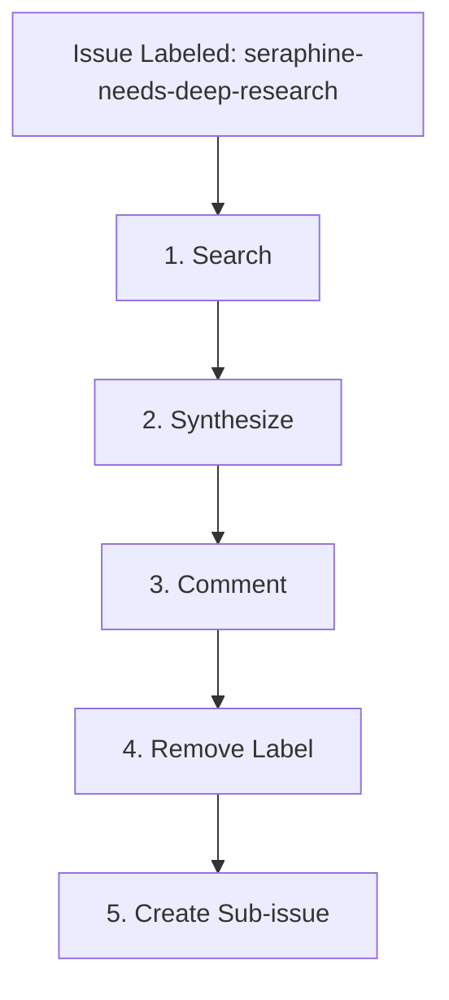

# 🔬 The `seraphine-needs-deep-research` Label Workflow

When an issue is labeled with `seraphine-needs-deep-research`, the AI assistant is triggered to perform comprehensive research on the problem space before moving into requirements gathering.

## 🔄 Workflow Lifecycle

## 📋 Phase Guidelines

### 1. Search
* **Action:** Deeply research the problem space using the `deep-research` skill or other available research tools.
* Evaluate options until at least 3 viable options/approaches are found (this acts as the sufficiency threshold).
* **Error States:**
  * **No Viable Options Found:** If extensive research yields no viable options, document the findings and the blockers. Post this as a comment and do NOT proceed to create a requirements sub-issue. Remove the `seraphine-needs-deep-research` label and stop execution.
  * **Ambiguous Problem Space:** If the problem space is too broad or ambiguous to yield concrete options, comment with clarifying questions, remove the `seraphine-needs-deep-research` label, and stop execution.

### 2. Synthesize
* **Action:** Synthesize the research findings organically. There is no strict formatting template required, but ensure that the pros and cons of the identified viable options are clearly presented to facilitate decision-making.

### 3. Comment
* **Action:** Post the synthesized summary of your findings as a comment on the parent issue.

### 4. Remove Label
* **Action:** Remove the `seraphine-needs-deep-research` label from the issue using the GitHub API or CLI.

### 5. Create Sub-issue
* **Action:** Create a new **native GitHub child sub-issue** to initiate the requirements gathering phase. Ensure the native GitHub sub-issue relationship is established with the parent issue.
* **Title:** `[Requirements] <Original Issue Title>`
* **Label:** Add the `seraphine-needs-requirements` label to the new sub-issue.
* **Assignee:** Assign the sub-issue to `brotherlogic-automation`.
* **Body:** Reference the parent issue and the research summary comment.
