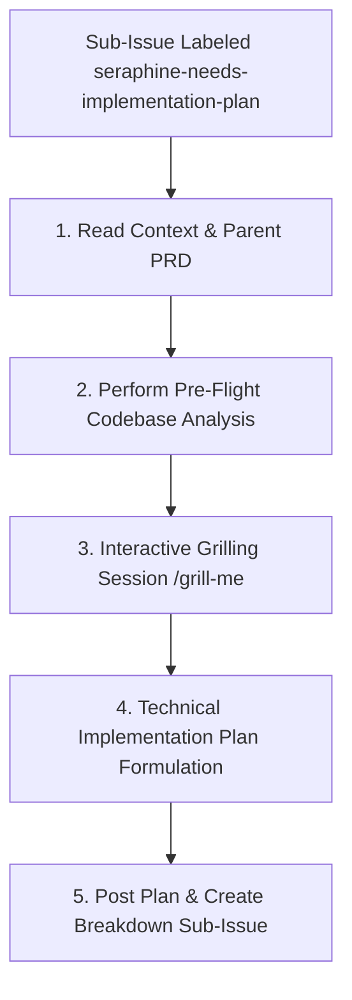

# 🛠️ The `seraphine-needs-implementation-plan` Label Workflow

When a sub-issue is labeled with `seraphine-needs-implementation-plan`, the AI assistant (**Seraphine**) is triggered to formulate a concrete, technical design and step-by-step implementation blueprint before any code changes are made.

## 🔄 Workflow Lifecycle

---

## 📋 Phase Guidelines

### 1. Read Context & Parent PRD
Seraphine reads the sub-issue description, extracts the reference link to the parent issue, and retrieves the approved Product Requirements Document (PRD) posted as a comment on the parent issue. This grounds all architectural decisions in the defined scope and user requirements.

### 2. Perform Pre-Flight Codebase Analysis
Before asking any grilling questions, Seraphine must perform a comprehensive scan of the codebase to gain a complete understanding of relevant schemas, services, packages, and UI files.
* **Scan Areas:**
  - Protocol Buffers: Files under `/proto/` that define the data model.
  - Backend: Directory structure and Go code under `/internal/` and `/cmd/`.
  - Frontend: React components and styles under `/frontend/src/` (if present).
* **Action:** Present a concise summary of the "Pre-Flight Analysis" to the user, highlighting existing structures that will be affected by the plan.

### 3. Interactive Grilling Session (`/grill-me`)
Seraphine initiates a technical grilling session with the developer/user. The session proceeds Socratically—**asking exactly one highly targeted question at a time** (never group or ask multiple questions at once)—and suggests sensible, best-practice defaults to resolve technical design ambiguities.
* **Precondition:** Before starting the session, the agent must ensure a thorough understanding of the codebase, the bug, and the context from previous phases.
* **Mandatory Probing Areas:**
  1. **Data Persistence & Schema:** Do we need new `.proto` messages/fields, or changes to how data is serialized and stored via `pstore`?
  2. **API Boundaries & gRPC Contracts:** Are new gRPC service definitions, RPC methods, or custom request/response models needed?
  3. **Backend Logic & Concurrency:** What Go packages and logic are affected? Are there concurrency considerations (contexts, channels, waitgroups)?
  4. **Frontend Architecture:** Which React components, custom hooks, or routes are affected? How should responsiveness and the premium styling system be applied?
  5. **Security & Auth:** Are there authentication, permission, or GitHub OAuth implications?
  6. **Error Handling & Fault Tolerance:** How do both frontend and backend handle offline states, network latency, API failures, or corrupt inputs?

### 4. Technical Implementation Plan Formulation
Once a shared understanding of technical details is reached, Seraphine compiles the blueprint.
* **Format:** The Implementation Plan must adhere to **Option A** structure:
  1. **Proposed Architecture / System Design:** A high-level overview of backend and frontend components.
  2. **Schema & Protocol Buffer Changes:** Specific `.proto` modifications (field numbers, types, message structures).
  3. **Backend (Go) Implementation Details:** File paths, package design, gRPC server methods, storage wrapper functions, and logic modifications.
  4. **Frontend (React) Implementation Details:** Component names, hook usage, routes, CSS design tokens, and styling updates.
  5. **Testing Strategy:** Plan for backend Go tests (`go test -v ./...`), integration verifications, and manual frontend testing steps.

### 5. Post Plan & Create Breakdown Sub-Issue
Seraphine posts the finalized implementation plan to the sub-issue using premium markdown formatting (collapsible `
` blocks, interactive task lists `- [ ]`, Mermaid diagrams, and direct file path links).
* **Action:**
  1. Remove the `seraphine-needs-implementation-plan` label from the current `[Implementation Plan]` issue.
  2. Programmatically create a new **native GitHub sub-issue**:
     - **Sub-Issue Title:** `[Breakdown] <Parent Issue Title>`
     - **Sub-Issue Label:** `seraphine-break-down-issue`
     - **Assignee:** `brotherlogic-automation`
     - **Sub-Issue Description:** A link referencing the `[Implementation Plan]` issue and instructing the agent to begin the issue breakdown. Ensure the native GitHub sub-issue relationship is established with the parent issue.
