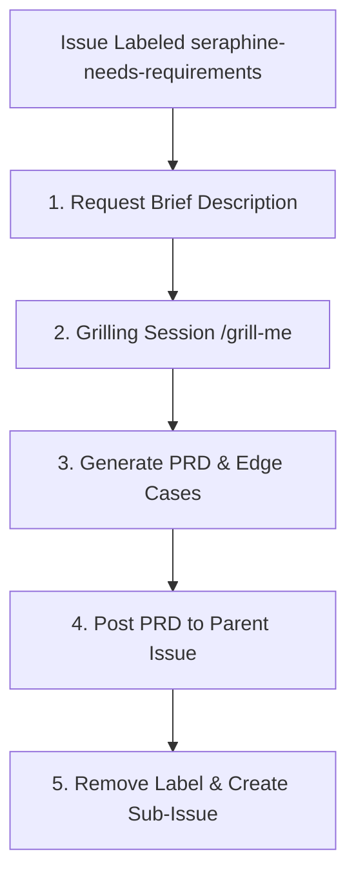

# 🏷️ The `seraphine-needs-requirements` Label Workflow

When a GitHub issue is labeled with `seraphine-needs-requirements` (or its variant `seraphine-need-requirements`), the AI assistant (**Seraphine**) is triggered to run a requirements-gathering process. This stage focuses strictly on **what** needs to be built and **why**, avoiding any early technical implementation details.

## 🔄 Workflow Lifecycle

---

## 📋 Phase Guidelines

### 1. Request Brief Description
Before starting any structured analysis, the agent must ask the developer/user to briefly describe the issue in their own words. This provides critical initial context and grounds the subsequent questions in the user's intent.
* **Action:** Post a concise response asking the user for a high-level summary and goals of the issue.

### 2. Interactive Grilling Session (`/grill-me`)
Once the initial description is provided, the agent initiates a focused grilling session using the `/grill-me` command or an interactive interview format.
* **Objective:** Uncover ambiguities, capture user stories, and map out requirements.
* **Rules:**
  - **Understand Context First:** Before starting the session, ensure you have thoroughly read and understood the codebase, the bug, and all associated details.
  - **One Question at a Time:** You must ask exactly one targeted question at a time. Do not group or ask multiple questions in a single turn.
  - **Focus on Requirements:** The questions must probe **only the requirements** of the issue. Do not discuss specific technologies, database schemas, API designs, or code architectures yet.
* **Probing Areas:**
  - Who is the end-user, and what is their primary flow?
  - What are the success criteria?
  - What are the functional boundaries (what is explicitly *in* scope vs. *out* of scope)?
  - What inputs are required, and what outputs are expected?

### 3. PRD & Edge Case Formulation
The outcome of the grilling session is compiled into a clear **Product Requirements Document (PRD)** type specification.
* **Format:** The PRD must be highly structured and contain:
  1. **Executive Summary / Goal**: The core value proposition of the issue.
  2. **User Stories**: Real-world scenarios (e.g., *"As a user, I want to..."*).
  3. **Functional Requirements**: Bulleted, actionable, and testable items.
  4. **Out of Scope**: Boundaries to prevent scope creep.
  5. **Edge Cases & Error States**: Explicit definitions of system behavior under unexpected inputs or failures.

> [!TIP]
> Ensure edge cases are exhaustive. Think about connection dropouts, empty states, limits on input lengths, and concurrent modifications.

### 4. GitHub Issue Synchronization & Sub-Issue Creation
Once the PRD is complete, the agent must execute the following automated steps on GitHub:
1. **Post the PRD:** Render the requirements document beautifully as a comment on the parent GitHub issue.
2. **Remove the Label:** Remove the `seraphine-needs-requirements` (or `seraphine-need-requirements`) label from the parent issue to signify completion of the requirements phase.
3. **Create Sub-Issue:** Programmatically create a **native GitHub sub-issue** to track the subsequent step:
   - **Sub-Issue Title:** `[Implementation Plan] <Parent Issue Title>`
   - **Sub-Issue Label:** `seraphine-needs-implementation-plan`
   - **Assignee:** `brotherlogic-automation`
   - **Sub-Issue Description:** A link referencing the parent issue and instructing the agent to begin drafting the implementation plan. Ensure the native GitHub sub-issue relationship is established with the parent issue.
