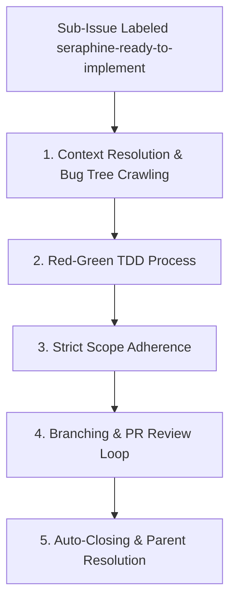

# 🛠️ The `seraphine-ready-to-implement` Label Workflow

When a granular child sub-issue is labeled with `seraphine-ready-to-implement`, the AI assistant is triggered to execute a disciplined engineering process to implement the specified component slice.

## 🔄 Workflow Lifecycle

---

## 📋 Phase Guidelines

### 1. Context Resolution & Bug Tree Crawling
Before writing any code, the agent must pull in all necessary context from the bug tree to understand where the task fits into the broader implementation.
* **Action:** Programmatically query GitHub using the `gh` CLI (e.g., executing `gh issue view <parent_id>`) to traverse up the issue hierarchy, locate the parent implementation plan, and reference the original approved Product Requirements Document (PRD).
* **Dependency Check & Polling:** Inspect the issue description, comments, and metadata to identify if it is dependent on other issues (e.g., prerequisite sub-issues). If open dependencies exist:
  * Do **not** proceed with implementation or modify the codebase.
  * Poll the status of each dependent issue (e.g., using `gh issue view <issue-number> --json state`) every 5 minutes.
  * Only move forward and start implementation once all identified dependent issues are fully resolved/closed.

### 2. Red-Green TDD Process
Follow a strict Test-Driven Development (TDD) cycle to ensure absolute correctness:
1. **Write Red Tests:** Write the new unit test(s) first. Run the test command (e.g., `go test -v ./...` or `npm run test`) and output the failing ("Red") terminal logs directly in the chat to prove the test is failing.
2. **Implement Green Code:** Write the implementation code. Run the tests again and verify that they pass cleanly ("Green").

### 3. Strict Scope Adherence
* **Rule:** The agent must only work on the specific component described in the sub-issue. Avoid any unrelated refactoring or feature additions to prevent scope creep.

### 4. Branching & PR Review Loop
1. Create a dedicated feature branch for the task. Ensure that at least one of your pushed commits includes the `Closes #<ISSUE_NUMBER>` (or `Resolves #<ISSUE_NUMBER>`) stanza in the commit message.
2. The repository CI/CD pipeline/PR builder will automatically extract this closing stanza and include it in the generated Pull Request description.
3. Review status in a loop to address any reviews, comments, or build failures on the PR until all comments are resolved.

### 5. Auto-Closing & Parent Resolution
* **Auto-Close:** Do NOT close the sub-issue manually. The CI/CD pipeline will automatically close the issue once the PR is merged, relying on the `Closes #<ISSUE_NUMBER>` stanza embedded in the Pull Request.
* **Parent Issue Checking:** Once the child issue is closed, programmatically inspect the parent issue (`[Breakdown]` issue) using the `gh` CLI to check if any other sibling sub-issues remain open.
* **Closing Parent Issues:** If and only if all sibling sub-issues are closed, proceed to close the parent `[Breakdown]` issue. Once the `[Breakdown]` issue is closed, close the associated `[Implementation Plan]` issue. Once the `[Implementation Plan]` issue is closed, close the original parent issue.
